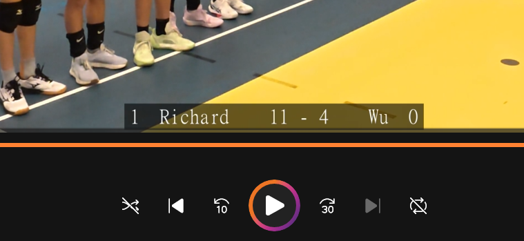

# Volleyball Scoreboard

A desktop application for adding an accurate score timeline to recorded volleyball game videos.

## Problem

Volleyball games are often recorded on an action camera and uploaded to YouTube for players, coaches, and parents to review. However, the recorded video usually does not contain the game score.

Without a score displayed on the video, it can be difficult to determine the game situation when reviewing a particular rally or play.

This application allows a user to record scores while reviewing a video and then automatically overlay the correct score onto a generated video.

## Goals

The application is designed to allow a user to:

1. Open a recorded volleyball game video.
2. Play, pause, seek, rewind, and fast-forward through the video.
3. Manually record a score change while watching the video.
4. Automatically capture the video timestamp when a score change is recorded.
5. Maintain the score for both teams throughout the game.
6. Review, edit, and remove previously recorded score events.
7. Save the score timeline and reopen it later.
8. Generate a new video with the current score displayed on the screen.
9. Preserve the original video file without modification during video generation.

## Application


## Scoreboard Overlay

Example of a generated volleyball video with the score displayed on the video.



## Basic Workflow

### 1. Open Video

The user selects a recorded video file, such as an MP4 file from an action camera.

The application displays the video and provides playback controls for reviewing the game.

### 2. Record Scores

While watching the video, the user clicks a button whenever a team wins a point.

For example:

```text
Team A +1
Team B +1
```

The application records the video timestamp and the resulting score.

Example:

```text
00:13:04.250    Team A    13 - 12
00:13:27.800    Team B    13 - 13
00:13:51.420    Team A    14 - 13
```

The score timeline is based on the video's playback position, allowing the score to be displayed at the corresponding time during video generation.

### 3. Review Score Events

The recorded events are displayed in a timeline so the user can review and correct the scoring history.

The application currently supports:

* Add a score event for either team
* Select a recorded event
* Delete a selected event
* Undo scoring events added during the current session
* Edit the timestamp of a recorded event
* Recalculate scores after an event is edited or deleted
* Change team names
* Configure the starting score before scoring begins
* Track the number of sets won by each team

### 4. Save Game Data

The score timeline is saved separately from the video in JSON format.

The saved game data contains:

* Video file information
* Team names
* Starting scores
* Sets won
* Timestamped scoring events
* The team associated with each scoring event
* Resulting scores after each event

When a saved game is opened, the application validates the game data before loading it.

If the original video file is no longer available, the saved game can still be opened. The scoring information and event history are preserved, and the user can select a replacement video without losing the recorded scores.

### 5. Generate Scored Video

After the score timeline is complete, the user can generate a new video.

The application uses the recorded timestamps to determine which score should be displayed at each point in the video.

For example:

```text
00:00:00 - 00:13:04    12 - 12
00:13:04 - 00:13:27    13 - 12
00:13:27 - 00:13:51    13 - 13
00:13:51 - ...         14 - 13
```

The scoreboard displays both team names and their current scores. FFmpeg renders the overlay onto the video and preserves the original audio.

The user can select a video quality setting before generation. The application also displays generation progress and elapsed time and allows the user to cancel an ongoing operation.

The generated video is saved to an output file. The user should choose a different output path from the source video to avoid overwriting the original recording.

## Functional Requirements

### Video Playback

* Open a video file
* Play and pause
* Seek to a specific position
* Rewind and fast-forward
* Display the current video time and total duration

### Score Management

* Support two teams
* Configure team names
* Configure starting scores before scoring begins
* Add one point to either team
* Display the current score
* Record the video timestamp for each score change
* Display scoring events in a timeline
* Select a recorded score event
* Undo scoring events added during the current session
* Delete a selected score event
* Edit the timestamp of a recorded score event
* Recalculate scores after event changes
* Track sets won by each team

### Project Management

* Create a new game
* Save game data in JSON format
* Open an existing saved game
* Associate a saved game with a video file
* Validate saved game data before loading it
* Open a saved game even when its original video file is missing
* Select a replacement video without clearing the saved scoring events
* Keep score data separate from the video file

### Video Generation and Scoreboard Overlay

* Generate a new video containing a scoreboard overlay
* Display both team names and their current scores
* Update the displayed score according to the video timestamp
* Preserve the original video's audio
* Select the output video quality
* Display video-generation progress
* Display elapsed generation time
* Cancel video generation
* Use FFmpeg for video processing

## Non-Functional Requirements

* Windows desktop application
* Simple and easy-to-use interface
* Works offline, with FFmpeg available locally
* Score recording should be fast enough to use while reviewing a game
* Support long video files, subject to available system resources and video format
* Validate saved game data and report invalid data
* Handle video-processing errors and cancellation
* Keep the original video separate from the generated output by using a different output path

## Future Improvements

The following features are outside the current version but may be considered later:

* More advanced editing of scoring events, including changing the team or score associated with an event
* Multiple sets with automatic set transitions and set-specific scoring
* Configurable scoreboard position
* Scoreboard themes and styling
* Keyboard shortcuts for playback and score entry
* Export score data to CSV
* Generate YouTube chapters
* Volleyball-specific statistics
* Player information and jersey numbers
* Rally and rotation tracking
* Automatic rally detection using computer vision or AI
* Player recognition
* Automatic score recognition from the original video

## Initial Scope

The first version is intentionally simple:

**Manual score entry + video playback + score timeline + FFmpeg video overlay.**

AI and automatic score recognition are **not part of Version 1**.

## Technology

The current implementation uses:

* **Python** — application programming language
* **PySide6** — desktop GUI framework
* **FFmpeg** — video processing and scoreboard overlay
* **JSON** — game and score data storage

Technology choices may evolve as the project develops.

## Project Structure

```text
volleyball-scoreboard/
├── src/
│   └── main.py
├── screenshots/
│   ├── scoreboard.png       # Main application screenshot
│   └── scored-video.png     # Example of the scoreboard overlaid on a video
├── examples/
│   └── sample_game.json     # Sample game file
├── README.md
└── ...
```

## Sample Game Data

If a sample game file is included in [`examples/sample_game.json`](examples/sample_game.json), it can be used to inspect the JSON structure for team information, starting scores, sets won, and timestamped scoring events.

## Status

This project is actively under development.

The current version supports video playback, manual score entry, score-event management, editing event timestamps, saving and loading game data, loading saved games when the original video is missing, and generating a scored video using FFmpeg. Video generation includes quality selection, progress reporting, elapsed-time display, and cancellation.
