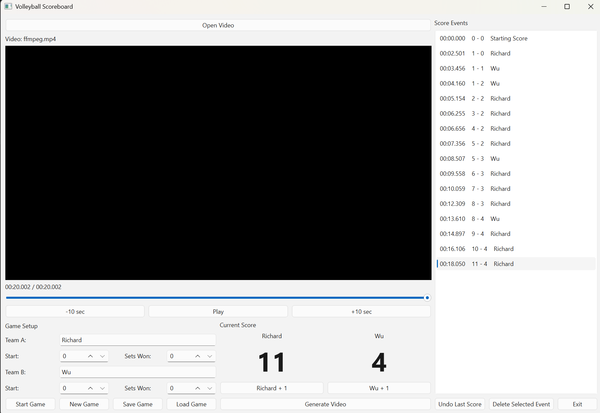

# Volleyball Scoreboard

A desktop application for adding an accurate score timeline to recorded volleyball game videos.

## Problem

Volleyball games are often recorded on an action camera and uploaded to YouTube for players, coaches, and parents to review. However, the recorded video usually does not contain the game score.

Without a score displayed on the video, it can be difficult to determine the game situation when reviewing a particular rally or play.

This application allows the score to be recorded while reviewing the video and then automatically adds the correct score to the final video.

## Goals

The application should allow a user to:

1. Open a recorded volleyball game video.
2. Play, pause, seek, rewind, and fast-forward through the video.
3. Manually record a score change while watching the video.
4. Automatically capture the exact video timestamp when a score change is recorded.
5. Maintain the score for both teams throughout the game.
6. Review, edit, or remove previously recorded score events.
7. Save the score timeline so it can be reopened later.
8. Generate a new video with the current score displayed on the screen.
9. Preserve the original video file without modification.

## Application



## Basic Workflow

### 1. Open Video

The user selects a recorded video file, such as an MP4 file from an action camera.

### 2. Record Scores

While watching the video, the user clicks a button whenever a team wins a point.

For example:

```text
Team A +1
Team B +1
```

The application records the video timestamp and the resulting score.

Example:

```text
00:13:04.250    Team A    13 - 12
00:13:27.800    Team B    13 - 13
00:13:51.420    Team A    14 - 13
```

### 3. Review Score Events

The user can review the recorded events and correct mistakes.

The application should allow the user to:

- Add an event
- Edit an event
- Delete an event
- Undo the most recent event
- Change team names
- Change the starting score

### 4. Save Game Data

The score timeline should be saved separately from the original video.

The saved data should contain at least:

- Video information
- Team names
- Starting score
- Score-change events
- Video timestamps
- Resulting scores

### 5. Generate Scored Video

After the score timeline is complete, the user can generate a new video.

The application uses the recorded timestamps to determine which score should be displayed at each point in the video.

For example:

```text
00:00:00 - 00:13:04    12 - 12
00:13:04 - 00:13:27    13 - 12
00:13:27 - 00:13:51    13 - 13
00:13:51 - ...         14 - 13
```

The score is rendered onto the video in a fixed location, such as the top-left or top-right corner.

The original video remains unchanged.

## Functional Requirements

### Video Playback

- Open common video formats, initially MP4.
- Play and pause.
- Seek to a specific position.
- Display current video time.
- Display total video duration.
- Support keyboard shortcuts where practical.

### Score Management

- Two teams.
- Configurable team names.
- Configurable starting score.
- Add one point to either team.
- Display the current score.
- Record the exact video timestamp for each score change.
- Undo the last score change.
- Edit or delete score events.

### Project Management

- Create a new game project.
- Save game data.
- Open an existing game project.
- Associate a project with a video file.
- Keep score data separate from the original video.

### Video Generation and Scoreboard Overlay

- Generate a new video containing a scoreboard overlay.
- Display both team names together with their current scores.
- Display each team's name next to its corresponding score.
- Update the displayed score based on the video timestamp.
- Allow the scoreboard position to be configured.
- Preserve the original video's audio.
- Produce a new video file without modifying the original video.
- Provide progress information while the video is being generated.

## Non-Functional Requirements

- Windows desktop application.
- Simple and easy-to-use interface.
- The application should work offline.
- The original video must never be modified.
- Score recording should be fast enough to use while watching a live game recording.
- The application should handle long video files.
- Video processing should provide progress information.
- The application should handle errors without losing the saved score data.

## Future Possibilities

These features are intentionally outside the initial version but may be considered later:

- Multiple sets in one game.
- Automatic detection of set changes.
- Volleyball-specific statistics.
- Player information and jersey numbers.
- Rally and rotation tracking.
- Export score data to CSV.
- Generate YouTube chapters.
- Custom scoreboard themes.
- Automatic rally detection using computer vision or AI.
- Player recognition.
- Automatic score recognition from the original video.

## Initial Scope

The first version should remain intentionally simple:

**Manual score entry + video playback + score timeline + FFmpeg video overlay.**

AI and automatic score recognition are **not part of Version 1**.

## Technology

The initial implementation is planned to use:

- **Python** — application programming language
- **PySide6** — desktop GUI
- **FFmpeg** — video processing and score overlay
- **JSON or SQLite** — project and score data storage

## Sample Game Data

A sample game file is provided in `examples/sample_game.json`.

The file contains the team information, starting score, set scores, and
timestamped scoring events used to generate the scoreboard overlay.


### The technology choices may evolve as the project develops.
